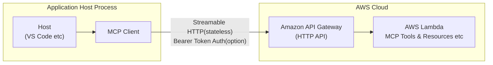

# lambda-mcp-adaptor

An MCP (Model Context Protocol) server SDK for AWS serverless architecture with familiar, official SDK-like API design and Bearer token authentication.

## What is lambda-mcp-adaptor?

`lambda-mcp-adaptor` is a TypeScript/JavaScript SDK that provides an official SDK-like experience for building MCP (Model Context Protocol) servers on AWS serverless architecture. It offers a clean, intuitive API similar to other popular SDKs, making it easy to define tools, resources, and prompts with Bearer token authentication support.

### Key Features

- **🚀 Official SDK-like API**: Familiar and intuitive interface similar to popular SDKs
- **⚡ Simple Tool Registration**: Easy-to-use fluent API for defining server capabilities
- **🌐 AWS Serverless Ready**: Built specifically for API Gateway and Lambda deployment
- **🔧 Zero Configuration**: Works out of the box with sensible defaults
- **🛡️ Built-in Validation**: Automatic input validation and error handling
- **📊 Stateless Architecture**: Designed for serverless environments (no session management)
- **🔐 Bearer Token Authentication**: Simple authentication with multiple validation methods

## MCP Protocol Implementation

This library implements the **Streamable HTTP transport** as defined in the [MCP specification 2025-03-26](https://modelcontextprotocol.io/specification/). Key implementation details:

- **Transport**: Uses HTTP POST requests for client-to-server communication
- **Protocol**: JSON-RPC 2.0 over HTTP with proper error handling
- **Architecture**: Stateless design for AWS Lambda serverless deployment

Unlike traditional MCP servers that may use session management, this implementation is designed for **stateless serverless environments**. This means each request is handled independently without maintaining server-side session state, which is a requirement for AWS Lambda deployments.

## Architecture



## Authentication

The library provides multiple authentication methods:

```javascript
import { createMCPServer, createLambdaHandler, Auth } from 'lambda-mcp-adaptor';

// Single Bearer token
const server = createMCPServer(config)
  .auth(Auth.bearerToken(process.env.MCP_TOKEN));

// Multiple Bearer tokens (for token rotation)
const server = createMCPServer(config)
  .auth(Auth.bearerTokens([process.env.MCP_TOKEN_1, process.env.MCP_TOKEN_2]));

// Custom authentication function
const server = createMCPServer(config)
  .auth(Auth.custom(async (authHeader) => {
    // Your custom validation logic
    return authHeader === `Bearer ${process.env.CUSTOM_TOKEN}`;
  }));
```

Authentication is optional - existing code works without authentication.

## Examples

See the [example](./example/) directory for complete working examples:
- **Basic Example** (`example/mcp-server/`): Simple MCP server without authentication
- **Authenticated Example** (`example/mcp-server-auth/`): Server with Bearer token authentication

Both examples are deployed on AWS serverless architecture (API Gateway + Lambda) with comprehensive tools and features including mathematical operations, text processing, and utility functions.

## Installation

Install directly from GitHub:

```bash
npm install github:moritalous/lambda-mcp-adaptor
```

## Quick Start with AWS SAM

### 1. Initialize SAM Application

```bash
sam init --runtime nodejs22.x --name my-mcp-server --app-template hello-world
cd my-mcp-server
```

### 2. Install Dependencies

```bash
npm install github:moritalous/lambda-mcp-adaptor zod
```

### 3. Create Your MCP Server

Replace the contents of `app.mjs`:

```javascript
import { createMCPServer, createLambdaHandler, Auth } from 'lambda-mcp-adaptor';
import { z } from 'zod';

// Create MCP server
const server = createMCPServer({
  name: 'My MCP Server',
  version: '1.0.0',
  description: 'A powerful MCP server with authentication'
});

// Add authentication (optional)
server.auth(Auth.bearerToken(process.env.MCP_TOKEN));

// Register tools with simple API
server.tool('calculate', {
  operation: z.enum(['add', 'subtract', 'multiply', 'divide']),
  a: z.number(),
  b: z.number()
}, async ({ operation, a, b }) => {
  let result;
  switch (operation) {
    case 'add': result = a + b; break;
    case 'subtract': result = a - b; break;
    case 'multiply': result = a * b; break;
    case 'divide': result = a / b; break;
  }
  
  return {
    content: [{ type: 'text', text: `${a} ${operation} ${b} = ${result}` }]
  };
});

// Export Lambda handler (handles all the complexity for you)
export const lambdaHandler = createLambdaHandler(server);
```

### 4. Update SAM Template

Update your `template.yaml` to include API Gateway and environment variables:

```yaml
AWSTemplateFormatVersion: '2010-09-09'
Transform: AWS::Serverless-2016-10-31

Parameters:
  MCPToken:
    Type: String
    Description: Bearer token for MCP authentication
    NoEcho: true

Resources:
  MCPServerFunction:
    Type: AWS::Serverless::Function
    Properties:
      CodeUri: ./
      Handler: app.lambdaHandler
      Runtime: nodejs22.x
      Environment:
        Variables:
          MCP_TOKEN: !Ref MCPToken
      Events:
        MCPEndpoint:
          Type: Api
          Properties:
            Path: /mcp
            Method: post
        MCPOptions:
          Type: Api
          Properties:
            Path: /mcp
            Method: options

Outputs:
  MCPServerApi:
    Description: "API Gateway endpoint URL for MCP Server"
    Value: !Sub "https://${ServerlessRestApi}.execute-api.${AWS::Region}.amazonaws.com/Prod/mcp"
```

### 5. Deploy

```bash
sam build
sam deploy --guided --parameter-overrides MCPToken=your-secret-token-here
```

## API Reference

### createMCPServer(config)

Creates a new MCP server instance.

```javascript
const server = createMCPServer({
  name: 'My Server',           // Required: Server name
  version: '1.0.0',           // Required: Server version
  description: 'Description', // Optional: Server description
  protocolVersion: '2025-03-26' // Optional: MCP protocol version
});
```

### server.auth(authMethod)

Add authentication to your MCP server (optional).

```javascript
// Single Bearer token
server.auth(Auth.bearerToken('your-secret-token'));

// Multiple Bearer tokens (for rotation)
server.auth(Auth.bearerTokens(['token1', 'token2']));

// Custom authentication
server.auth(Auth.custom(async (authHeader) => {
  // Your validation logic
  return isValidToken(authHeader);
}));
```

### server.tool(name, inputSchema, handler)

Register a tool with automatic input validation.

```javascript
server.tool('tool_name', {
  param1: z.string().describe('Parameter description'),
  param2: z.number().optional().default(42),
  param3: z.enum(['option1', 'option2'])
}, async ({ param1, param2, param3 }) => {
  // Tool implementation with validated inputs
  return {
    content: [{ type: 'text', text: 'Result' }],
    isError: false // Optional: indicates if this is an error response
  };
});
```

**Input Schema Types:**
- `z.string()` - String parameter
- `z.number()` - Numeric parameter
- `z.boolean()` - Boolean parameter
- `z.enum(['a', 'b'])` - Enumerated values
- `z.array(z.string())` - Array of strings
- `z.object({...})` - Nested object
- `.optional()` - Optional parameter
- `.default(value)` - Default value
- `.describe('...')` - Parameter description

**Return Format:**
```javascript
{
  content: [
    { type: 'text', text: 'Response text' },
    { type: 'image', data: 'base64...', mimeType: 'image/png' }
  ],
  isError: false // Optional: true for error responses
}
```

### createLambdaHandler(server)

Creates an AWS Lambda handler for API Gateway integration from an MCP server instance.

```javascript
export const lambdaHandler = createLambdaHandler(server);
```

## Testing Your Server

```javascript
import { createMCPServer, Auth } from 'lambda-mcp-adaptor';
import { z } from 'zod';

// Create test server
const server = createMCPServer({
  name: 'Test Server',
  version: '1.0.0'
});

// Add authentication
server.auth(Auth.bearerToken('test-token'));

server.tool('test_tool', {
  input: z.string()
}, async ({ input }) => {
  return { content: [{ type: 'text', text: `Echo: ${input}` }] };
});

// Test tool directly
const result = await server.handleRequest({
  jsonrpc: '2.0',
  id: 1,
  method: 'tools/call',
  params: {
    name: 'test_tool',
    arguments: { input: 'Hello World' }
  }
});

console.log(result); // { content: [{ type: 'text', text: 'Echo: Hello World' }] }
```

## Contributing

1. Fork the repository
2. Create a feature branch
3. Add tests for new functionality
4. Submit a pull request

## License

Licensed under the Apache License, Version 2.0. See [LICENSE](LICENSE) for details.

## Related Resources

- [MCP Specification](https://modelcontextprotocol.io/specification/) - Official MCP documentation
- [MCP Streamable HTTP Transport](https://modelcontextprotocol.io/specification/2025-03-26/basic/transports#streamable-http) - Transport specification
- [Zod Documentation](https://zod.dev/) - Schema validation library
- [AWS Lambda Documentation](https://docs.aws.amazon.com/lambda/) - AWS Lambda guide
- [AWS API Gateway Documentation](https://docs.aws.amazon.com/apigateway/) - AWS API Gateway guide
